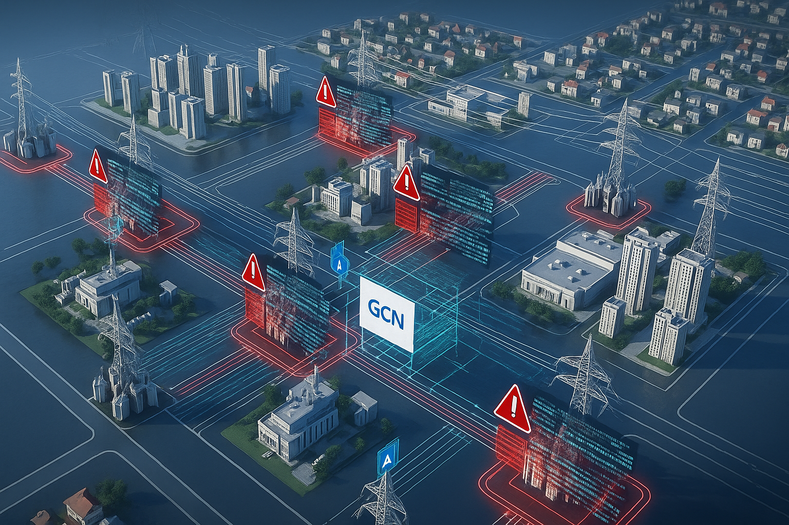

# MAGIC_Attack_Detection

# AttackGenerationViaSMARTDS.ipynb

This repository contains a comprehensive pipeline for simulating and detecting cyber-physical attacks in realistic three-phase unbalanced power distribution networks using:

-  [SMART-DS Dataset](https://www.nrel.gov/grid/smart-ds.html) — realistic 3-year load profiles and feeder topologies
-  [OpenDSS](https://sourceforge.net/projects/electricdss/) — high-fidelity power flow engine

---

## Setup

### Create Environment

```bash
conda create -n cyberphys python=3.11
conda activate cyberphys
```

### Install Dependencies

```bash
pip install .
pip install torch==2.0.1 torchvision torchaudio --index-url https://download.pytorch.org/whl/cu117
pip install cplxmodule numpy==1.24.4 scikit-learn pyarrow matplotlib opendssdirect
```

---

## Functionality

### Simulation Capabilities

- Run 3-phase power flows using OpenDSS
- Extract normalized admittance matrix (Ybus)
- Optimize PMU placements via greedy submodular search
- Simulate PV inverters under **VV/VW control curves**
- Inject **physical attacks** by manipulating inverter curves
- Inject **FDI attacks** using stealthy null-space perturbations
- Add **voltage measurement noise** for realism
- Run **MMSE-based state estimation**
- Generate labeled voltage phasors for GCN training/testing


## Attack Details

### Physical Attack: **Phase Imbalance via Control Curve Manipulation**

- Targets **phase 2** of selected PV inverters.
- Alters **Volt-Var (VV)** and **Volt-Watt (VW)** control curves to intentionally **misregulate power injections**.
- Simulates **compromised DER firmware or malicious DERMS commands**.
- Results in **voltage imbalance**, distorted flow estimations, and degraded situational awareness.

### Generate Voltage Phasor Data

```python
FlagGen = 1  # Enable data generation loop
```

Then run the notebook or script:

```bash
python main_simulation.py
```

This creates:

- `Vall_ReIm_New.npy` — complex voltage phasors (with attack)
- `attack_label_New.npy` — binary labels (physical attacks)

### Add FDI Attacks + Noise

```python
FlagFDI = 1
voltage_scale_factor = 0.01

data_obtain = data_loader_FDIPhy(file_path1, file_path2, Y_NodeOrder=Y_NodeOrder)
data_obtain.state_est_withFDI(Y_norm_sparse, sensor_location_indices, voltage_scale_factor)
```

- PMU Noise (voltage_scale_factor):
Realistic multiplicative Gaussian noise is applied to voltage measurements.

- FDI Attack (attack_vec_da):
A stealthy, additive false data injection vector is crafted using the null space of the sensor-only Ybus submatrix and added after noise to corrupt selected PMU measurements without raising simple detection alarms.

### Save Outputs

```bash
Vphasor_FDI_Physical_WithVoltageNoise.npy
AttackLabel_FDI_Physical_WithVoltageNoise.npy
metadata_run_config.npy
```

---

## Dataset Description

- `Vphasor_*.npy`: shape `(timepoints, nodes, samples)`
- `AttackLabel_*.npy`: shape `(timepoints, #PV + #muPMU)`
- `metadata_run_config.npy`: simulation configuration dictionary

---

## Next Step: Graph-Based Learning

Use the `.npy` files as input to train GNNs for attack detection.

---
# FDIPhyDet_Final.ipynb

## Overview

This repository implements a deep learning pipeline for the joint detection of:

- **Physical attacks** at PV inverters (voltage control curve manipulation)
- **False Data Injection (FDI) attacks** on measurement sensors (e.g., mu-PMUs)

It integrates:

- Time-series simulation of unbalanced 3-phase distribution systems (via OpenDSS)
- Complex-valued GCN (Graph Convolutional Network) for spatiotemporal attack detection
- ROC-AUC metrics for model evaluation

---

## Features

- Uses **OpenDSS** to simulate voltage behavior of PV-rich feeders
- Greedy optimization for **sensor placement**
- **Synthetic attack injection** for physical and FDI scenarios
- Dataset construction for **GCN training and testing**
- Accurate **binary classification** of attack locations over time

---

## Workflow Summary

1. **Import 3-phase unbalanced distribution network** from OpenDSS (.dss format)
2. **Place sensors optimally** using greedy observability maximization
3. **Run time-series simulations** for 35,040 timepoints (1 year of 15-min data)
4. **Inject physical attacks** by modifying PV control parameters (VV/VW)
5. **Inject FDI attacks** on voltage measurements (with optional voltage noise)
6. **Create labeled dataset** (voltage phasors, attack labels)
7. **Train/test GCN** to classify physical and FDI attacks
8. **Evaluate via ROC curves and accuracy**

---

## File Structure

```
├── scenarios/                    # OpenDSS networks and timeseries
├── *.npy                         # Saved numpy files: voltages, labels, metadata
├── *.pth                         # Trained PyTorch models
├── *.py                          # Core scripts: training, testing, plotting
├── metadata_run_config.npy       # Metadata for indexing, sensor info, nodes
```

---

## Metadata Implementation

The file `metadata_run_config.npy` stores a dictionary for all necessary experiment info:

### Contents

```python
metadata = {
  'total_timepoints': 35040,
  'sampling_rate': 20,
  'pv_feeders': [...],         # List of PV node names
  'sensor_nodes': [...],       # List of mu-PMU sensor node names
  'Y_node_order': [...],       # Canonical node ordering used in Ybus
}
```

### Usage

This file is loaded in both the training and testing phases to ensure consistent:

- Mapping between node indices and names
- Sensor attack indexing
- Y-bus matrix ordering

```python
metadata = np.load("metadata_run_config.npy", allow_pickle=True).item()
Y_NodeOrder = metadata["Y_node_order"]
sensor_location_indices = [Y_NodeOrder.index(s) for s in metadata["sensor_nodes"]]
```

---


## Results Summary

| Metric             | Score   |
| ------------------ | ------- |
| ROC-AUC (Physical) | \~0.993 |
| ROC-AUC (FDI)      | \~0.956 |
| Combined ROC-AUC   | \~0.970 |


### ROC Curve Visualizations

<p align="center">
  
  
  
</p>

---
