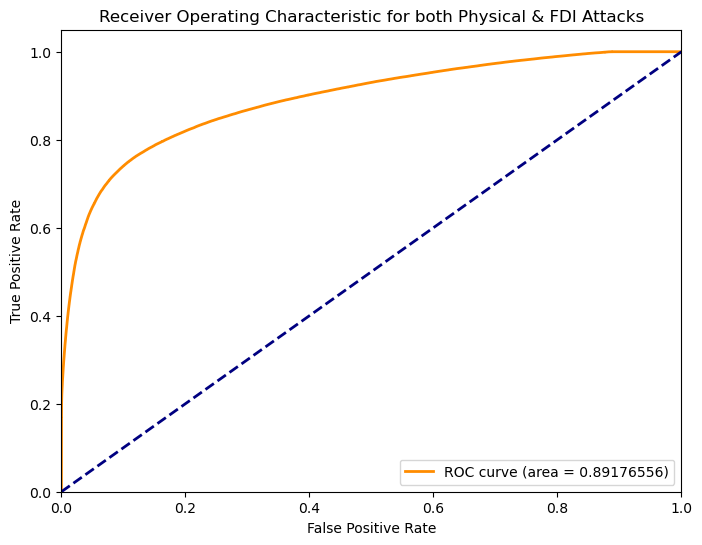
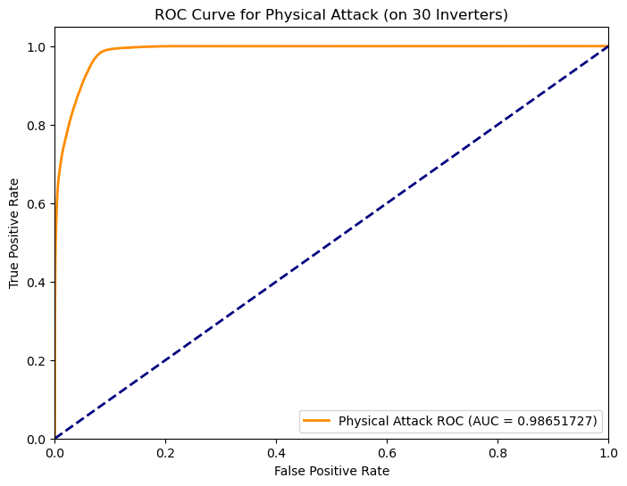
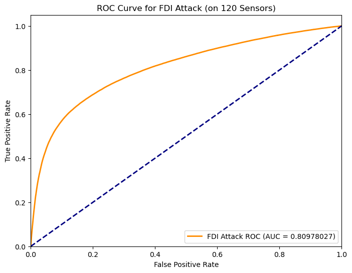

# AttackGenerationViaSMARTDS.ipynb
Generation of Labeled Voltage Phasors under Physical and FDI Attacks Using SMART-DS and OpenDSS

## Overview

This notebook provides a comprehensive workflow to generate a high-fidelity dataset of voltage phasors in three-phase unbalanced distribution networks under both physical and stealthy False Data Injection (FDI) attacks. The data generation leverages:

- **[SMART-DS](https://data.openei.org/submissions/2790)**: a large-scale, realistic dataset of U.S. distribution networks with three-year historical load and solar data across multiple voltage levels.
- **[OpenDSS](https://sourceforge.net/projects/electricdss/)**: an industry-grade, open-source simulation tool for power flow analysis in distribution systems.

The end result is a time-series dataset of complex voltage phasors labeled with attack types, suitable for use in machine learning tasks such as anomaly detection, graph signal processing, and distribution network state estimation under adversarial conditions.

## Objectives

- Simulate physical control manipulation at PV inverters (tampering with Volt-Var/Volt-Watt curves).
- Inject stealthy FDI attacks on PMU voltage measurements to evade traditional bad-data detection.
- Generate labeled voltage phasors at all nodes over time.
- Store data in NumPy-compatible format for downstream use in GNN/GCN training.

## Attack Types Considered

### 1. Physical Attacks
- Direct manipulation of distributed energy resources (DERs), specifically by altering the Volt-Var and Volt-Watt control curves of PV inverters.
- Attack randomly targets phase-2 connected PV inverters during each timestep.
- Labeled attack vectors indicate which PV nodes are compromised.

### 2. False Data Injection (FDI) Attacks
- Sophisticated stealthy corruption of voltage measurements from mu-PMU sensors.
- FDI is injected in a way that mimics realistic attacker knowledge, bypassing traditional bad-data detectors.
- MMSE-based estimation is then used to reconstruct the system's true voltage state from corrupted measurements.

## SMART-DS Dataset Structure

SMART-DS includes 3-year (2016–2018) time-series data at multiple voltage levels:

- **230 kV** – Sub-transmission level  
- **69 kV** – Substation level  
- **4–25 kV** – Feeder levels

```
SMART-DS/
├── GIS/
├── PLACEMENTS/
└── YEARS/
    └── <YEAR>/
        └── <DATASETS>/
            ├── full_dataset_analysis/
            └── <SUB-REGIONS>/
                ├── load_data/
                ├── solar_data/
                ├── cyme_profiles/
                └── scenarios/
                    └── opendss/
                        └── <SUBSTATIONS>/
                            └── <FEEDERS>/
```

## Sensor Placement Strategy

To ensure observability and data fidelity:
- The top-`k` singular vectors from the normalized admittance matrix (`Y`) are used.
- A greedy algorithm optimally places 120 mu-PMU sensors based on maximizing the smallest singular value of the sensor matrix.
- A seed set of 30 known PV-connected sensor locations are pre-selected.
- The remaining 90 sensors are strategically placed across the network for maximum coverage and robustness to stealthy FDI.

## Measurements.py

- Simulates realistic sensor measurements by injecting noise into OpenDSS voltage outputs.
- Computes node-level currents using the Y-bus matrix and voltage phasors.
- Generates noisy voltage, current, and power readings for mu-PMUs and power meters (currently none) as inputs for attack detection and state estimation.

## Requirements

```bash
# Python 3.11 environment setup
pip install .
pip install torch==2.0.1 torchvision torchaudio --index-url https://download.pytorch.org/whl/cu117
pip install cplxmodule numpy==1.24.4 scikit-learn pyarrow
```

## data_loader.py

- Loads voltage phasor data and physical attack labels from .npy or .mat files into memory for processing and training.
- Simulates noisy sensor readings using OpenDSS voltages and currents via the measurements() function.
- Injects stealthy False Data Injection (FDI) attacks on a random subset of sensors by manipulating noisy measurements using null-space projections of the admittance matrix.
- Performs MMSE state estimation to reconstruct the full voltage profile of the grid using both noisy and attacked sensor data.
- Generates time-aligned input-output pairs for GCN training by providing voltage states (data_recover) and combined attack labels (label_truth).
- Provides flexible data access through next_state() for sampling features and labels at arbitrary timesteps.
- Includes rollout storage for PyTorch training, enabling mini-batch generation and sequential data insertion with complex-valued support.

## graph_loader.py
- Parses node and edge CSV files to build mappings and construct graph structures for buses and their connections.
- Encodes complex edge weights using a custom IdentityEncoder for use in graph neural network training.
- Converts sparse Y-bus matrices (from OpenDSS) into batched edge lists and labels for physical system graphs.
- Implements graph batching logic via single2batch_int() to duplicate and offset graphs across time or instances.
- Supports time-evolving graph construction using tempo2graph(), which builds temporal edges across snapshots.
- Generates spatial-temporal graph datasets by combining structural and temporal edges in single2batch_GT().
- Handles edge and label conversion into PyTorch tensors for compatibility with geometric deep learning frameworks.
- Provides modular graph construction utilities for integrating power grid topology into GCN-based models.
  
# FDIPhyDet_Final.ipynb
Joint Detection of Physical and FDI Attacks in Distribution Networks

## Overview

This notebook implements a joint detection framework using Graph Convolutional Networks (GCNs) to identify both physical attacks on PV inverters and stealthy False Data Injection (FDI) attacks on measurement sensors in unbalanced 3-phase distribution networks. The framework builds on OpenDSS simulation outputs and leverages realistic time-series data generated from SMART-DS-based networks.

## Workflow

### 1. Import Network
- Import a selected feeder from OpenDSS (.dss format) with 3-phase unbalanced topology and PV inverter models.

### 2. Input Data
- Use `Vphasor_FDI_Physical_WithVoltageNoise.npy` for MMSE-estimated voltage phasors with both attack types.
- Use `AttackLabel_FDI_Physical_WithVoltageNoise.npy` for binary ground-truth labels:
  - First 30 entries: physical attack labels (one per PV inverter)
  - Next 120 entries: FDI attack labels (one per mu-PMU sensor)

### 3. Y Matrix and Sensor Topology
- Extract complex admittance (Y) matrix.
- Normalize and sparsify it to derive the Graph Shift Operator (GSO).
- Use metadata to identify optimal sensor placements from the original simulation run.

### 4. GCN Architecture
- A hybrid complex-valued temporal-spatial model with:
  - 1D complex convolutions across time
  - Chebyshev polynomial-based graph convolutions across spatial structure
  - Fully connected layers with complex-to-real projection for binary classification

### 5. Training
- Binary Cross Entropy loss with weighted regularization:
  - Higher penalty on physical attack errors (λ_physical > λ_FDI)
- Training disabled by default (`FlagTrain = 0`); toggle to re-train the model.

### 6. Testing
- Loads a pre-trained model (`FDIPhyAtkDet_156_New.pth`)
- Performs classification and computes:
  - Binary accuracy per timestep
  - ROC AUC scores for:
    - Physical attack detection
    - FDI attack detection

### 7. Evaluation Metrics
- Accuracy (timestep-level and average)
- ROC Curve for:
  - Combined attack detection
  - Physical-only detection
  - FDI-only detection

## Model Details

```text
- Input: Voltage phasors (complex-valued), shape: [time, nodes, window]
- Output: Binary labels (physical & FDI), shape: [time, 150]
- Architecture:
    CplxConv1d → ReLU → ChebGraphConv → CplxLinear → Sigmoid
```

## Outputs

- Trained GCN weights: `FDIPhyAtkDet_156_New.pth`
- ROC plots:
  - `ROC Curve for both Physical & FDI Attacks`
  - `ROC Curve for Physical Attacks`
  - `ROC Curve for FDI Attacks`


## Metadata Usage

A critical component of this pipeline is the use of `metadata_run_config.npy`, which ensures consistency, reproducibility, and correct graph construction throughout both simulation and learning phases.

### Metadata Contents

The metadata dictionary contains:

```python
metadata = {
    "total_timepoints": total_timepoints,           # e.g., 35040
    "sampling_rate": sampling_rate,                 # e.g., 20 per timepoint
    "pv_feeders": pv_feeder,                        # List of PV inverter node names
    "sensor_nodes": all_optimal_sensors,            # 120 mu-PMU sensor locations
    "Y_node_order": Y_NodeOrder                     # Ordered list of node names from OpenDSS
}
```

### How Metadata Is Used

1. **Sensor Indexing**
   - Convert node names of mu-PMUs to index positions using:
     ```python
     sensor_location_indices = [Y_NodeOrder.index(s) for s in sensor_nodes]
     ```
   - These indices are used for:
     - Injecting FDI attacks on targeted nodes.
     - Extracting voltage phasors from correct locations.
     - Ensuring correct spatial alignment during graph construction.

2. **Graph Shift Operator (GSO) Construction**
   - The normalized admittance matrix (`Y_norm_sparse`) is ordered according to `Y_NodeOrder`.
   - This enables accurate Chebyshev graph convolution with physical network topology.

3. **Reproducibility**
   - By storing metadata:
     - The simulation can be reproduced without re-running OpenDSS.
     - Any downstream model (GCN, estimator, detector) can be retrained or evaluated consistently.


## Results Summary

| Metric             | Score   |
| ------------------ | ------- |
| ROC-AUC (Physical) | \~0.986 |
| ROC-AUC (FDI)      | \~0.809 |
| Combined ROC-AUC   | \~0.891 |


### ROC Curve Visualizations

<p align="center">
  
  
  
</p>

---
#### 1. Combined Detection Performance

The first ROC curve shows the model's performance in detecting both physical and FDI attacks across all 150 monitored locations (30 PV inverters + 120 sensors). The **AUC is 0.8918**, indicating strong overall detection capability.

#### 2. FDI Attack Detection

The second ROC curve isolates performance on the **120 FDI-targeted mu-PMU sensors**. The model achieves an **AUC of 0.8098**, reflecting solid performance in identifying stealthy, measurement-level attacks.

#### 3. Physical Attack Detection

The third ROC curve evaluates detection on the **30 PV inverters** undergoing Volt-Var/Volt-Watt curve manipulation. The model performs exceptionally well here, with an **AUC of 0.9865**, indicating near-perfect recognition of compromised DERs.
